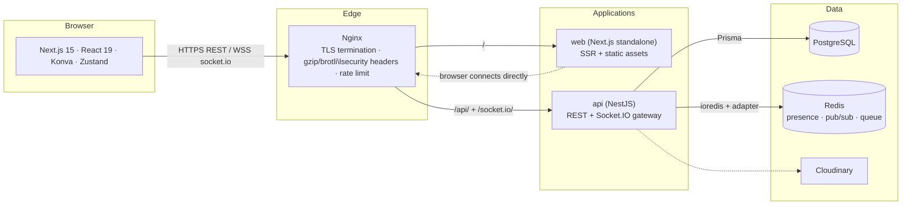

# Collaborative Whiteboard

A production-grade collaborative whiteboard platform combining the best of **Excalidraw**, **Miro**, and **FigJam** — real-time multi-user drawing, sticky notes, comments, chat, rich editing, version history, and project management.

## Highlights

- **Real-time collaboration**: cursors, live drawing, presence, chat, comments, notifications.
- **Infinite canvas**: zoom, pan, minimap, grid + snap, smart guides, grouping, layers, alignment.
- **Rich toolset**: pen, pencil, highlighter, shapes, arrows, connectors, bezier, text, sticky notes, images, icons, emoji, eraser.
- **Full lifecycle**: autosave, undo/redo, version snapshots, activity timeline, import/export (PNG/JPEG/SVG/PDF/JSON).
- **Sharing & roles**: invite by email or link, public/private links with expiry, Owner/Editor/Commenter/Viewer roles.
- **Auth**: JWT + refresh tokens, Google OAuth, email verification, password recovery, RBAC.

## Tech Stack

| Layer      | Technology                                                                                     |
| ---------- | ---------------------------------------------------------------------------------------------- |
| Frontend   | Next.js 15 (App Router), React 19, TypeScript, Tailwind CSS, shadcn/ui, Zustand, React Hook Form, Zod, Konva.js |
| Backend    | NestJS, TypeScript, Prisma ORM, Socket.IO                                                      |
| Database   | PostgreSQL, Redis                                                                              |
| Storage    | Cloudinary                                                                                     |
| Infra      | Docker, GitHub Actions, Vercel (web), Render/Railway/ECS (api), Nginx, Sentry                  |

## Repository Layout

```
collaborative-whiteboard/
├── apps/
│   ├── web/        # Next.js frontend (@whiteboard/web)
│   └── api/        # NestJS backend (@whiteboard/api)
├── packages/
│   └── shared/     # Shared types, DTOs, validation schemas (@whiteboard/shared)
├── deploy/         # Nginx edge proxy, health-check script, rollback runbook
├── .github/        # GitHub Actions workflows (ci.yml, deploy.yml)
├── docs/           # PRD, architecture, ADRs, phase tracker
├── docker-compose.prod.yml  # Full production stack (nginx + web + api + db + redis)
└── .env.example    # Documented environment variable contract
```

This is an **npm workspaces monorepo**. Every workspace is a first-class npm package.

## Getting Started

```bash
# 1. Install all workspace dependencies from the repo root
npm install

# 2. Configure environment variables
#    web  -> copy .env.example to apps/web/.env.local and fill values
#    api  -> copy .env.example to apps/api/.env and fill values

# 3. Start infrastructure (PostgreSQL + Redis) with Docker
docker compose -f apps/api/docker-compose.yml up -d   # added in Phase 2

# 4. Run database migrations
npm run prisma:migrate --workspace @whiteboard/api     # prisma migrate dev

# 5. Start both apps in development
npm run dev                                             # runs web + api
```

## Architecture



Realtime fan-out uses the Socket.IO Redis adapter so multiple API replicas stay
in sync; presence, per-element versions, rate limits and the refresh-token
denylist all live in Redis. See [docs/ARCHITECTURE.md](docs/ARCHITECTURE.md)
for the full decision log.

## Production Deployment

The repo ships a complete production stack: `apps/api/Dockerfile`,
`apps/web/Dockerfile`, `deploy/nginx` (edge proxy) and
`docker-compose.prod.yml`.

### One-command stack (any Docker host)

```bash
# 1. Configure production environment
cp .env.example .env          # fill in every required value (compose fails fast)

# 2. TLS certificates into deploy/nginx/certs/ (fullchain.pem + privkey.pem)
#    see deploy/nginx/certs/README.md for self-signed local setup

# 3. Build, migrate and start everything
docker compose -f docker-compose.prod.yml up -d --build

# 4. Verify
curl -f https://your-domain/health
```

Service topology: `nginx :80/:443 → web :3001 (Next.js standalone) → api :3000
(NestJS) → postgres :5432 + redis :6379`. Only nginx exposes ports; databases
and app containers live on the internal `whiteboard` network. Prisma migrations
run once via the `migrate` service before the API starts
(`service_completed_successfully` gate).

### CI/CD (GitHub Actions)

| Workflow      | Trigger            | What it does                                                                                     |
| ------------- | ------------------ | ------------------------------------------------------------------------------------------------ |
| `.github/workflows/ci.yml`     | PRs & pushes to main | Lint → typecheck → test → build across all workspaces                                        |
| `.github/workflows/deploy.yml` | Push to main         | Quality gate → build/push images to GHCR (sha- + `deploy/N`-tagged) → Sentry release → Vercel deploy (web) / Render hook (api) → health-check gate → git tag |

Required repository **secrets**: `SENTRY_AUTH_TOKEN`, `SENTRY_ORG`,
`SENTRY_PROJECT_API`, `SENTRY_PROJECT_WEB`, `NEXT_PUBLIC_SENTRY_DSN`,
`UPTIME_CHECK_URL_API`, `UPTIME_CHECK_URL_WEB`, `VERCEL_TOKEN`,
`VERCEL_ORG_ID`, `VERCEL_PROJECT_ID`, optional `RENDER_DEPLOY_HOOK_URL`.
Repository **variables**: `NEXT_PUBLIC_API_URL`, `NEXT_PUBLIC_SOCKET_URL`,
`NEXT_PUBLIC_APP_URL`, `NEXT_PUBLIC_GOOGLE_CLIENT_ID`. Missing optional secrets
skip their step instead of failing the pipeline.

### Observability

- **Errors** — Sentry on both apps (`@sentry/node` captures 5xx from the API's
  exception filter; `@sentry/nextjs` instruments server, edge and browser,
  including the global error boundary). Releases are tagged with the deploy SHA.
- **Logs** — pino structured JSON logs on the API with `service`,
  `environment`, `context` and a `requestId` on every line via
  AsyncLocalStorage correlation of the `x-request-id` middleware.
- **Health / uptime** — `GET /health` verifies DB reachability; the deploy
  pipeline blocks on it (`deploy/scripts/health-check.sh`) and external uptime
  monitors should target the same endpoint plus the web root.

### Rollback

Every deployment is immutable and tagged (`deploy/<run_number>`); rollback is a
redeploy of the previous tag through the same pipeline. Full runbook:
[deploy/ROLLBACK.md](deploy/ROLLBACK.md).

## Development Scripts (root)

| Command               | Description                                  |
| --------------------- | -------------------------------------------- |
| `npm run dev`         | Run all workspaces in dev mode               |
| `npm run dev:web`     | Run the Next.js app                          |
| `npm run dev:api`     | Run the NestJS API                           |
| `npm run build`       | Build all workspaces                         |
| `npm run typecheck`   | Type-check all workspaces                    |
| `npm run lint`        | Lint all workspaces                          |
| `npm run test`        | Test all workspaces                          |

## Documentation

- [Product Requirements Document](docs/PRD.md)
- [Architecture & ADRs](docs/ARCHITECTURE.md)
- [Phase Tracker](docs/PHASES.md)
- [Performance budgets, measurements & load testing](docs/PERFORMANCE.md)
- [Deployment & rollback runbook](deploy/ROLLBACK.md)

## Testing

| Layer          | Tool      | Location                                              |
| -------------- | --------- | ----------------------------------------------------- |
| Web unit       | Vitest    | `apps/web/src/**/*.spec.ts` (406 tests)               |
| Web e2e        | Playwright| `apps/web/e2e/**/*.spec.ts` (needs API + `npx playwright install chromium`) |
| API unit       | Jest      | `apps/api/src/**/*.spec.ts` (incl. socket harness)    |
| API e2e        | Jest      | `apps/api/test/*.e2e-spec.ts`                         |
| Load           | k6        | `apps/api/scripts/load-test.js`                       |
| Perf + a11y    | Lighthouse | `apps/web/lighthouserc.js`                            |

```bash
npm run test          # all workspaces
npm run test:e2e --workspace @whiteboard/api
npm run test:e2e --workspace @whiteboard/web   # needs API running
k6 run apps/api/scripts/load-test.js   # needs infra + API running
```

## Roadmap

Built in 15 tracked phases — see [docs/PHASES.md](docs/PHASES.md) for the current status. Each phase lands on `main` as an independently shippable commit.

## License

[MIT](LICENSE)
